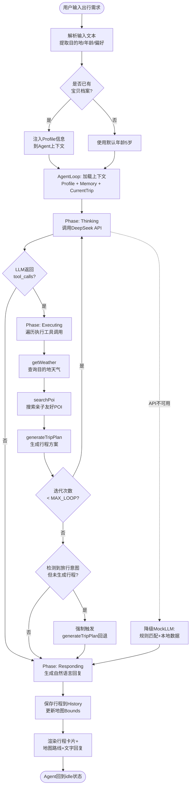
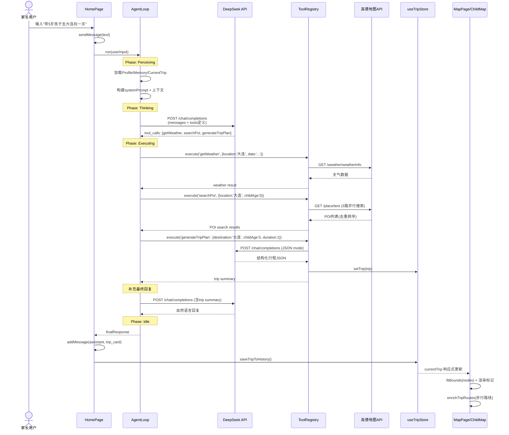
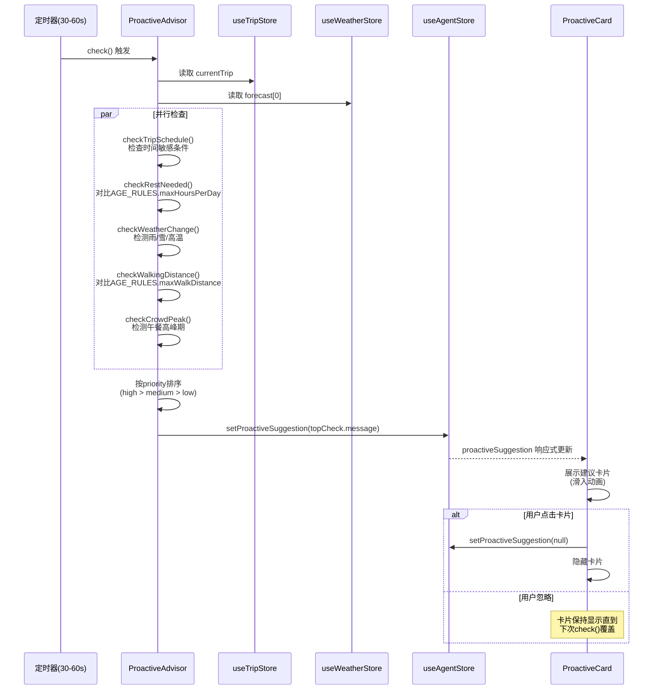
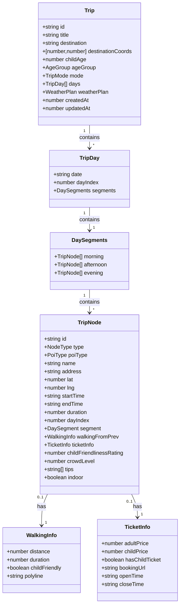
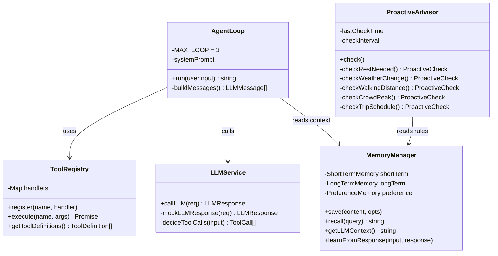
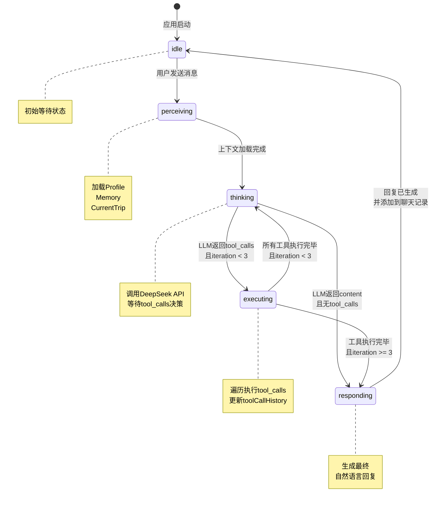
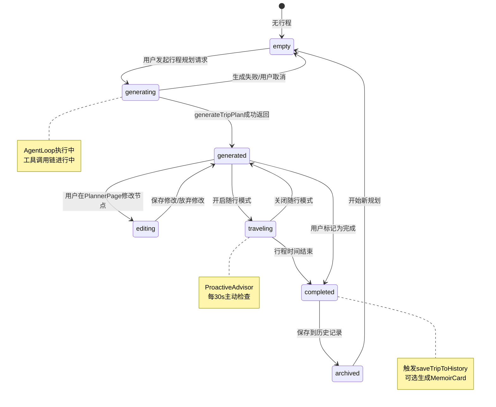
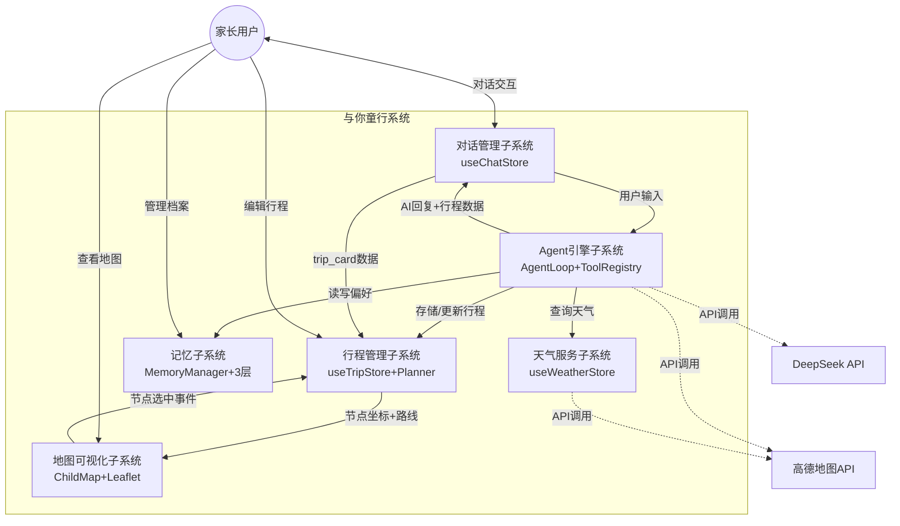
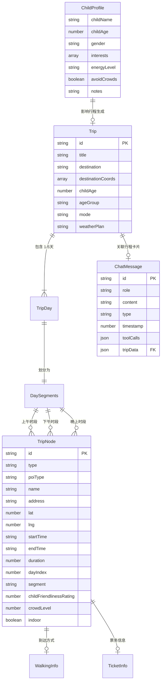

# 与你童行 — AI亲子出行规划智能体

# 需求分析与需求建模报告

---

**项目名称：** 与你童行（Yu-Ni-Tong-Xing）—— AI亲子出行规划智能体

**课程名称：** 2026年度软件工程课程设计

**项目选题：** 旅行规划一站式服务智能体设计与实现

**助教：** 庞广洋（QQ: 879313838）

**文档版本：** v1.0

**编写日期：** 2026年7月3日

---

## 版本历史

| 版本 | 日期 | 修改内容 | 作者 |
|------|------|---------|------|
| v1.0 | 2026-07-03 | 初始版本：需求陈述 + 分析建模 | 项目组 |

---

## 目录

- [第1章 引言](#第1章-引言)
  - [1.1 项目背景与意义](#11-项目背景与意义)
  - [1.2 项目目标](#12-项目目标)
  - [1.3 文档范围与读者](#13-文档范围与读者)
  - [1.4 术语定义与缩略语](#14-术语定义与缩略语)
- [第2章 需求陈述](#第2章-需求陈述)
  - [2.1 用户角色分析](#21-用户角色分析)
  - [2.2 功能性需求](#22-功能性需求)
  - [2.3 非功能性需求](#23-非功能性需求)
  - [2.4 约束条件](#24-约束条件)
- [第3章 需求建模](#第3章-需求建模)
  - [3.1 用例模型](#31-用例模型)
  - [3.2 活动图](#32-活动图)
  - [3.3 顺序图](#33-顺序图)
  - [3.4 领域模型/类图](#34-领域模型类图)
  - [3.5 状态图](#35-状态图)
- [第4章 数据模型](#第4章-数据模型)
  - [4.1 核心数据结构](#41-核心数据结构)
  - [4.2 数据字典](#42-数据字典)
  - [4.3 数据流图](#43-数据流图)
  - [4.4 实体关系图](#44-实体关系图)
- [第5章 系统架构概览](#第5章-系统架构概览)
  - [5.1 整体架构](#51-整体架构)
  - [5.2 模块划分](#52-模块划分)
  - [5.3 技术选型](#53-技术选型)
  - [5.4 关键设计决策](#54-关键设计决策)
- [附录](#附录)

---

# 第1章 引言

## 1.1 项目背景与意义

### 1.1.1 亲子出行市场的痛点分析

随着二孩、三孩政策的实施，亲子出行已成为中国家庭消费的重要组成部分。然而，当前市场上主流的出行规划工具存在以下显著痛点：

1. **缺乏年龄分层考量**：高德地图、携程等通用出行工具采用"成人思维"设计，无法区分0-3岁婴儿、4-6岁学龄前儿童、7-12岁学龄儿童在体力、兴趣、安全等方面的巨大差异。例如，0-3岁婴幼儿需要午休时段和母婴室，而7-12岁学龄儿童则适合科普教育类目的地。

2. **天气变化应对不足**：亲子出行中，天气突变（如下雨、高温）会严重影响行程体验。现有工具缺乏"一键切换室内备选方案"的能力，家长需要在多个App之间手动搜索替代景点。

3. **碎片化决策困境**：家长往往在临时决定出行（如周末早上临时起意），需要在短时间内完成目的地选择、路线规划、设施查询、票务确认等多项决策。现有工具信息分散，需要在多个App间切换。

4. **图文脱节问题**：传统地图工具提供路线，传统AI助手提供文字攻略，但两者无法联动——文字修改后地图不更新，地图调整后文字描述不变化，无法实现"一句话调整，图文同步更新"。

### 1.1.2 AI智能体在出行规划领域的应用前景

2025-2026年，大语言模型（LLM）技术快速发展，以DeepSeek、通义千问等为代表的国产大模型在工具调用（Function Calling）、多轮对话、意图理解等方面取得了显著进步。AI智能体（AI Agent）能够通过"感知-思考-执行-响应"的循环，自主调用多种工具完成复杂任务，为出行规划场景提供了全新的技术范式。

### 1.1.3 vivo快应用生态的轻量化优势

vivo快应用是基于手机系统的免安装应用生态，用户无需下载安装App，可直接从负一屏、全局搜索、快应用中心、Jovi语音助手等入口一键启动。这一特性与亲子出行场景高度契合：家长可在临时决定出行时即时获取规划服务，无需等待App下载安装，极大降低了首次使用门槛。

## 1.2 项目目标

### 1.2.1 核心目标

构建一个**分年龄分层的AI亲子出行规划智能体**，能够根据孩子的年龄段（0-3岁/4-6岁/7-12岁）自动调整行程节奏、步行距离、休息频率、POI推荐策略，生成真正适合该年龄段孩子的出行方案。

### 1.2.2 差异化目标

打造"**童行地图**"——一张卡通手绘风格的亲子专属互动路线图，区别于传统地图的冰冷蓝色折线，以温暖的手绘风格、颜色分时段、可爱图标标注、节点全交互能力，实现"一张图搞定所有出行需求"。

### 1.2.3 体验目标

实现**自然语言对话式全程交互**，支持文本和语音双模态输入，覆盖"出行前规划→出行中随行调整→出行后分享回顾"全链路对话闭环。用户只需用自然语言描述需求（如"带5岁孩子周末去大连金石滩玩一天"），AI在10秒内生成完整方案。

### 1.2.4 平台目标

基于vivo快应用生态，实现免安装即开即用，借助系统级定位、离线缓存、PWA等能力，确保应用在弱网环境下的可用性。

## 1.3 文档范围与读者

本文档覆盖软件工程课程设计的**里程碑①（需求陈述）**和**里程碑②（分析建模）**，主要内容包括：

- 项目功能性与非功能性需求的完整陈述
- 基于UML的用例模型、活动图、顺序图、类图、状态图
- 核心数据模型、数据字典、数据流图
- 系统整体架构概览

**目标读者：** 课程指导教师、助教、项目组全体成员。

## 1.4 术语定义与缩略语

| 术语/缩略语 | 全称 | 说明 |
|------------|------|------|
| AI Agent | Artificial Intelligence Agent | 基于LLM的智能体，能自主规划、调用工具、执行任务 |
| LLM | Large Language Model | 大语言模型，本项目使用DeepSeek Chat API |
| POI | Point of Interest | 兴趣点，如景点、餐厅、卫生间等 |
| 童行地图 | Child Travel Map | 本项目核心功能：卡通手绘风格亲子专属路线图 |
| PWA | Progressive Web Application | 渐进式Web应用，支持离线缓存和添加到主屏幕 |
| Agent Loop | Agent Tool-Calling Loop | 智能体工具调用循环：感知→思考→执行→响应 |
| Function Calling | 函数调用/工具调用 | LLM根据上下文自主决定调用哪个外部工具的能力 |
| NFR | Non-Functional Requirement | 非功能性需求（性能、可用性等） |
| FR | Functional Requirement | 功能性需求 |

---

# 第2章 需求陈述

## 2.1 用户角色分析

### 2.1.1 主要用户角色

本项目面向**有0-12岁孩子的家长用户**，按孩子年龄段细分为三类核心角色：

#### 角色A：0-3岁婴幼儿家长 —— "安全+舒适"优先型

| 属性 | 描述 |
|------|------|
| 典型用户 | 新手父母，孩子尚在婴儿/学步期 |
| 核心诉求 | 安全第一、行程节奏缓慢、必须有母婴室 |
| 体力特征 | 孩子无法长时间步行，需要推婴儿车 |
| 每日时长上限 | ≤4小时（含交通） |
| 关键需求 | 午休时段(12:00-14:00)强制预留、目的地500米内必须有母婴室、优先室内场所 |
| 痛点 | 传统App不标注母婴室位置、不避开台阶路段、不考虑午休 |

#### 角色B：4-6岁学龄前儿童家长 —— "探索+互动"优先型

| 属性 | 描述 |
|------|------|
| 典型用户 | 孩子上幼儿园，精力旺盛但耐力有限 |
| 核心诉求 | 在安全前提下激发好奇心，穿插互动体验 |
| 体力特征 | 连续步行不超过1.5公里，需频繁休息 |
| 每日时长上限 | ≤6小时（含交通和用餐） |
| 关键需求 | 每45分钟安排一次休息/零食时间、穿插互动体验型项目（手工作坊、动物互动、儿童剧）、避免连续"纯参观"景点 |
| 痛点 | 行程节奏单一，孩子容易无聊 |

#### 角色C：7-12岁学龄儿童家长 —— "学习+挑战"优先型

| 属性 | 描述 |
|------|------|
| 典型用户 | 孩子上小学，求知欲强，体力较好 |
| 核心诉求 | 游玩中融入知识成长元素 |
| 体力特征 | 步行距离可达3公里，可轻度户外徒步 |
| 每日时长上限 | ≤8-10小时（弹性） |
| 关键需求 | 科普教育类目的地（博物馆、天文馆、海洋馆）、AI生成趣味知识卡片、可适当安排登山/徒步 |
| 痛点 | 传统攻略缺乏针对儿童的趣味知识内容 |

### 2.1.2 用户场景

#### 场景1：临时周末出游规划

> 周六早上，小明的爸爸临时决定带5岁的小明去大连玩一天。他打开"与你童行"，用语音说："带5岁孩子去大连金石滩玩一天，不要太累，要有亲子餐厅，最好能看海。"AI在10秒内生成了包含上午海滩玩沙、中午亲子海鲜餐厅、下午海洋科技馆的完整行程方案和卡通路线图。

#### 场景2：出行途中天气突变

> 一家人在户外游玩时突降大雨。妈妈对"与你童行"说："下雨了，换个室内的地方。"AI根据天气数据自动生成室内备用方案，将户外景点替换为附近的室内科技馆和商场亲子区，一键切换备用方案。

#### 场景3：多日远途旅行规划

> 暑假期间，家长计划带8岁孩子去北京玩3天。"与你童行"根据学龄模式规则，规划了Day1历史探索（故宫+国家博物馆）、Day2科技之旅（中国科技馆+天文馆）、Day3自然体验（北京动物园+海洋馆）的三日行程。

#### 场景4：出行后分享回顾

> 行程结束后，家长一键生成高清"童行地图"图片，分享到家庭群和朋友圈。系统自动记录本次行程到"成长足迹"，方便日后回顾。

## 2.2 功能性需求

### 2.2.1 智能对话交互模块（FR-DIALOG）

| 编号 | 需求名称 | 详细描述 | 优先级 |
|------|---------|---------|--------|
| FR-D01 | 自然语言文本输入 | 用户可通过文本输入框输入出行需求，系统基于LLM进行意图识别和需求提取 | P0 |
| FR-D02 | 语音输入与识别 | 用户可通过语音按钮进行语音输入，系统支持语音识别转文本后处理 | P0 |
| FR-D03 | 多轮对话上下文维护 | 系统在对话过程中维护完整的行程上下文，支持连续追问（如"这个景点人多吗""换个近一点的"），无需重复背景信息 | P0 |
| FR-D04 | 快捷操作建议 | 系统根据当前对话状态，在输入框上方提供快捷操作按钮（如"换个室内景点""附近母婴室""延长游玩时间"） | P1 |
| FR-D05 | Agent状态可视化 | 系统以进度指示器实时展示AI Agent的当前阶段：感知中→思考中→执行中→回复中 | P1 |

### 2.2.2 行程规划引擎模块（FR-PLAN）

| 编号 | 需求名称 | 详细描述 | 优先级 |
|------|---------|---------|--------|
| FR-P01 | 分年龄行程生成 | 根据孩子年龄自动应用对应规则引擎：0-3岁婴幼儿模式（≤4h/天，午休强制，母婴室500m）、4-6岁学龄前模式（≤6h/天，45min休息，互动优先）、7-12岁学龄模式（≤8-10h/天，教育优先） | P0 |
| FR-P02 | 多日行程规划 | 支持1-5天行程规划，按天组织景点，确保不同日期的景点主题不重复 | P0 |
| FR-P03 | 行程节点实时调整 | 支持对已生成行程进行节点级操作：替换景点、删除节点、修改时间安排、调整停留时长 | P0 |
| FR-P04 | 三种出行模式切换 | 支持标准/悠闲/紧凑三种出行节奏模式，一键切换后路线和时间自动整体调整 | P1 |
| FR-P05 | 行程持久化存储 | 已生成的行程方案自动保存到本地存储（localStorage），支持历史行程查看和重新加载 | P0 |
| FR-P06 | 双预案管理 | 同时生成晴天/雨天两套方案，支持一键切换 | P1 |

### 2.2.3 童行地图模块（FR-MAP）

| 编号 | 需求名称 | 详细描述 | 优先级 |
|------|---------|---------|--------|
| FR-M01 | 卡通手绘风格路线图 | 基于Leaflet+高德地图瓦片，以温暖手绘风格呈现亲子出行全貌，区别于传统地图的冰冷蓝色折线 | P0 |
| FR-M02 | 分时段颜色标注 | 用不同颜色区分上午/下午/晚上行程段，一目了然 | P0 |
| FR-M03 | 差异化节点图标 | 用9种可爱图标标注不同类型节点（乐园/博物馆/餐厅/母婴室/停车场/卫生间/饮水处/室内游玩/科技馆） | P0 |
| FR-M04 | 步行路线绘制 | 在相邻行程节点之间绘制步行路线，标注步行距离和预计耗时 | P0 |
| FR-M05 | 节点点击信息卡片 | 点击地图上任意节点，弹出亲子专属信息卡片，包含评级/票价/开放时间/评价等详情 | P0 |
| FR-M06 | 一键导航至外部地图 | 从信息卡片中一键跳转到高德地图进行导航 | P1 |
| FR-M07 | 周边设施检索 | 查看节点周边范围内亲子设施（母婴室/卫生间/饮水处/餐厅），基于地理坐标实时检索 | P1 |
| FR-M08 | 成长足迹历史回放 | 在地图上以足迹标记展示用户历史行程中的地点，形成"成长足迹"视觉化回忆 | P2 |
| FR-M09 | 地图视野自适应 | 根据行程节点自动计算最佳地图视野（center+zoom），确保所有节点可见 | P1 |

### 2.2.4 天气与双预案模块（FR-WEATHER）

| 编号 | 需求名称 | 详细描述 | 优先级 |
|------|---------|---------|--------|
| FR-W01 | 目的地天气查询 | 根据出行日期和目的地，查询天气预报（天气状况/温度/风力/降雨概率） | P0 |
| FR-W02 | 室内备选方案生成 | 当天气为雨/雪/高温时，自动生成以室内场所为主的备用行程方案 | P1 |
| FR-W03 | 晴天/雨天双预案切换 | 路线图上用天气图标标注当日天气提醒，支持在晴天方案和雨天方案之间一键切换 | P1 |

### 2.2.5 亲子设施服务模块（FR-FACILITY）

| 编号 | 需求名称 | 详细描述 | 优先级 |
|------|---------|---------|--------|
| FR-F01 | 附近设施搜索 | 查询当前位置或指定节点周边的亲子刚需设施：母婴室、儿童卫生间、亲子饮水处、亲子餐厅 | P0 |
| FR-F02 | 票务信息查询 | 查询景点的儿童票政策、成人票/儿童票价格、开放时间、是否需要预约 | P1 |
| FR-F03 | 休息点智能推荐 | 根据孩子年龄和已游玩时长，智能推荐附近合适的休息点 | P1 |
| FR-F04 | 设施顺路串联 | 系统自动识别路线沿途200米范围内的刚需设施，智能插入到行程节点之间 | P1 |

### 2.2.6 记忆与偏好模块（FR-MEMORY）

| 编号 | 需求名称 | 详细描述 | 优先级 |
|------|---------|---------|--------|
| FR-M01 | 宝贝信息档案管理 | 用户可创建/编辑孩子的信息档案：昵称、年龄、性别、体力水平、兴趣爱好、是否避开人流、特殊备注 | P0 |
| FR-M02 | 偏好自动学习 | 系统从用户的对话交互中自动提取偏好（如喜欢/不喜欢的景点类型、餐饮偏好），沉淀到长期记忆 | P1 |
| FR-M03 | 历史行程记录 | 自动记录已完成的行程，支持按时间线回顾 | P1 |
| FR-M04 | 三层记忆系统 | 短期记忆（会话级，30条上限）+ 长期记忆（跨会话，50条上限）+ 偏好记忆（键值对，如"喜欢博物馆""避开人流密集"） | P1 |

### 2.2.7 分享与导出模块（FR-SHARE）

| 编号 | 需求名称 | 详细描述 | 优先级 |
|------|---------|---------|--------|
| FR-S01 | 路线图图片保存 | 将童行地图生成高清图片，保存到本地相册 | P2 |
| FR-S02 | 行程文档导出 | 导出行程文字文档，方便打印或离线查看 | P2 |
| FR-S03 | 原生分享调用 | 调用系统原生分享面板，将行程链接/图片分享到微信等应用 | P2 |
| FR-S04 | 纪念卡片生成 | 行程结束后自动生成带统计数据的纪念卡片（游玩天数/步行距离/打卡点数等） | P2 |

### 2.2.8 AI智能体引擎模块（FR-AGENT）

| 编号 | 需求名称 | 详细描述 | 优先级 |
|------|---------|---------|--------|
| FR-A01 | 工具调用循环 | LLM根据用户意图自主决定调用哪些工具，支持多轮工具调用（最大3次迭代），自动组合工具链完成复杂任务 | P0 |
| FR-A02 | 10个AI工具 | 系统注册10个专用工具：searchPoi / getWeather / generateTripPlan / adjustTrip / findNearbyFacility / checkTicketInfo / generateAlternativePlan / suggestRestSpot / saveToMemory / queryMemory | P0 |
| FR-A03 | 主动式建议推送 | 在出行途中，系统根据当前时间、天气、已游玩时长等条件，主动推送休息提醒/天气预警/人流高峰提醒/行程进度提醒 | P1 |
| FR-A04 | 随行模式 | 用户可开启随行模式，系统按时间线自动推送：出发前提醒准备→午餐时间推荐餐厅→下午建议休息→行程结束建议保存回忆 | P1 |
| FR-A05 | 旅行意图强制回退 | 当检测到用户有明显旅行意图但LLM未调用行程生成工具时，系统自动强制触发generateTripPlan，确保核心流程不中断 | P0 |
| FR-A06 | 灵活降级策略 | DeepSeek API不可用时，切换到规则引擎+本地Mock数据模式，确保应用在无API Key或网络故障时仍可演示 | P0 |

## 2.3 非功能性需求

### 2.3.1 性能需求

| 编号 | 需求描述 | 指标 |
|------|---------|------|
| NFR-P01 | AI行程生成首响应时间 | < 20秒 |
| NFR-P02 | Agent工具调用迭代次数 | ≤ 3次 |
| NFR-P03 | 地图首屏渲染时间 | < 3秒 |
| NFR-P04 | 语音识别处理延迟 | < 2秒 |
| NFR-P05 | 行程数据本地加载时间 | < 500ms |

### 2.3.2 可用性需求

| 编号 | 需求描述 | 说明 |
|------|---------|------|
| NFR-U01 | 免安装即开即用 | 基于快应用/PWA模式，不需要下载安装App |
| NFR-U02 | 自然语言交互 | 零学习成本，用户无需了解任何命令格式 |
| NFR-U03 | 移动端优先 | 界面适配手机屏幕（max-w-md），触控友好的交互尺寸 |
| NFR-U04 | 离线缓存 | 已生成的行程方案和路线图缓存到本地，无网络时仍可查看 |
| NFR-U05 | 错误友好处理 | API调用失败时给出明确提示并提供替代方案，不崩溃 |

### 2.3.3 可靠性需求

| 编号 | 需求描述 | 说明 |
|------|---------|------|
| NFR-R01 | LLM服务降级 | DeepSeek API超时（20s）或不可用时，自动切换到Mock LLM模式 |
| NFR-R02 | 地图API降级 | 高德地图API不可用时，使用本地POI数据库（北京14+大连15+通用城市模板） |
| NFR-R03 | 存储降级 | 优先使用localStorage，异常时使用内存存储确保应用不中断 |
| NFR-R04 | 网络超时处理 | 所有外部API调用设置超时上限（高德10s / DeepSeek 20s），超时后触发降级 |

### 2.3.4 可维护性需求

| 编号 | 需求描述 | 说明 |
|------|---------|------|
| NFR-M01 | 模块化状态管理 | 7个独立Zustand Store，职责清晰，互不耦合 |
| NFR-M02 | 工具注册表 | 基于ToolRegistry模式，工具可动态注册/替换，遵循开闭原则 |
| NFR-M03 | 常量与逻辑分离 | 将年龄规则（AGE_RULES）、POI类型（POI_TYPES）、颜色（COLORS）等配置与业务逻辑分离 |
| NFR-M04 | TypeScript类型安全 | 所有接口和数据结构使用TypeScript类型定义，编译时类型检查 |

### 2.3.5 安全性需求

| 编号 | 需求描述 | 说明 |
|------|---------|------|
| NFR-S01 | API Key保护 | API Key通过Vite环境变量（VITE_*）注入，不硬编码在源代码中 |
| NFR-S02 | 数据本地化 | 用户数据（行程/偏好/宝贝信息）仅存储在浏览器本地，不上传到第三方服务器 |
| NFR-S03 | 输入安全 | 对外部输入进行基本校验，防止XSS攻击 |

## 2.4 约束条件

### 2.4.1 技术约束

| 编号 | 约束描述 |
|------|---------|
| C-T01 | 前端框架必须使用 React 18+ TypeScript |
| C-T02 | 构建工具使用 Vite |
| C-T03 | 状态管理使用 Zustand |
| C-T04 | 地图引擎使用 Leaflet + 高德地图瓦片 |
| C-T05 | AI模型使用 DeepSeek Chat API |
| C-T06 | 目标平台为 vivo快应用（基于 Capacitor Android 打包） |
| C-T07 | UI样式使用 TailwindCSS |

### 2.4.2 时间约束

| 编号 | 约束描述 |
|------|---------|
| C-S01 | 项目总周期：2026年6月29日 - 7月24日，共4周 |
| C-S02 | 需求陈述检查：7月3日 |
| C-S03 | 需求分析建模检查：7月3日 - 7月10日 |
| C-S04 | 概要设计检查：7月10日 |
| C-S05 | 详细设计检查：7月17日 |
| C-S06 | 编码实现与测试检查：7月24日 |
| C-S07 | 最终答辩与系统演示：暂定7月24日 |

### 2.4.3 资源约束

| 编号 | 约束描述 |
|------|---------|
| C-R01 | 团队规模：4人 |
| C-R02 | DeepSeek API免费额度有限，需合理控制调用频率 |
| C-R03 | 高德地图API每日调用次数有上限（个人开发者） |

---

# 第3章 需求建模

## 3.1 用例模型

### 3.1.1 系统边界与参与者

**系统名称：** 与你童行 AI亲子出行规划智能体

**系统边界：** 前端应用（React SPA） + Agent引擎 + 本地存储

**主要参与者：**
- **家长用户**（按年龄段细分为婴幼儿家长/学龄前家长/学龄家长三个子角色）

**外部系统参与者：**
- **DeepSeek LLM服务**：提供大语言模型推理能力（Function Calling + 文本生成）
- **高德地图API**：提供POI搜索、天气查询、步行路线规划、地理编码服务
- **vivo快应用平台**：提供系统级入口、定位权限、离线缓存等系统能力

### 3.1.2 用例图

```mermaid
graph TD
    subgraph 系统边界[与你童行 AI亲子出行规划智能体]
        UC01[UC-01 智能对话规划行程]
        UC02[UC-02 查看与管理行程方案]
        UC03[UC-03 管理孩子信息档案]
        UC04[UC-04 出行途中随行服务]
        UC05[UC-05 分享与导出行程]
        
        UC01 --> UC01_1[文本输入出行需求]
        UC01 --> UC01_2[语音输入出行需求]
        UC01 --> UC01_3[多轮对话调整行程]
        
        UC02 --> UC02_1[查看童行地图]
        UC02 --> UC02_2[编辑行程节点]
        UC02 --> UC02_3[切换出行模式]
        UC02 --> UC02_4[切换天气双预案]
        
        UC04 --> UC04_1[查找附近设施]
        UC04 --> UC04_2[查询景点票务]
        UC04 --> UC04_3[获取休息建议]
        UC04 --> UC04_4[开启随行模式]
        
        UC05 --> UC05_1[保存路线图图片]
        UC05 --> UC05_2[导出行程文档]
        UC05 --> UC05_3[分享行程链接]
        UC05 --> UC05_4[生成纪念卡片]
    end
    
    家长用户((家长用户)) --> UC01
    家长用户 --> UC02
    家长用户 --> UC03
    家长用户 --> UC04
    家长用户 --> UC05
    
    UC01 -.-> DeepSeek[DeepSeek LLM服务]
    UC01 -.-> 高德地图[高德地图API]
    UC04 -.-> 高德地图
    
    UC03 --> UC03_1[创建编辑宝贝档案]
    UC03 --> UC03_2[查看历史行程]
```



### 3.1.3 用例详细描述

#### UC-01：智能对话规划行程（核心用例）

| 字段 | 内容 |
|------|------|
| **用例编号** | UC-01 |
| **用例名称** | 智能对话规划行程 |
| **参与者** | 家长用户（主要）；DeepSeek LLM服务、高德地图API（外部系统） |
| **前置条件** | 1. 应用已启动并完成初始化 2. 可选：用户已在Profile页面填写了孩子信息 |
| **后置条件** | 1. 生成完整的Trip行程方案（文字+地图） 2. 聊天记录新增AI回复消息 3. 行程历史自动保存 |
| **基本事件流** | 1. 用户在对话框输入或说出出行需求（如"带5岁孩子去大连玩一天"）<br>2. 系统将用户消息添加到聊天记录，显示Agent"思考中"状态<br>3. AgentLoop启动：加载上下文（Profile/Memory/CurrentTrip）→ 调用DeepSeek API<br>4. LLM返回工具调用序列：[getWeather, searchPoi, generateTripPlan]<br>5. Agent依次执行工具：查询天气 → 搜索POI → 生成行程方案<br>6. 系统在聊天界面展示行程卡片（TripResultCard）+ 图文联动更新地图<br>7. Agent生成自然语言回复："好的！已为您规划好大连一日亲子行程🌟..." |
| **备选事件流** | 3a. DeepSeek API不可用 → 降级使用Mock LLM模式，基于规则引擎生成<br>3b. 用户输入无旅行意图（如"你好"） → Agent直接文本回复，不调用工具<br>4a. LLM未调用generateTripPlan工具 → 系统检测旅行意图，强制触发回退机制<br>5a. 高德API不可用 → 降级使用本地POI数据库生成 |
| **异常事件流** | 3c. 网络请求超时（20s） → 自动降级Mock，提示用户"网络不稳定，已使用离线模式"<br>3d. LLM返回格式异常 → 解析失败时使用fallback文本回复 |

#### UC-02：查看与管理行程方案

| 字段 | 内容 |
|------|------|
| **用例编号** | UC-02 |
| **用例名称** | 查看与管理行程方案 |
| **参与者** | 家长用户 |
| **前置条件** | 当前存在有效的Trip行程方案 |
| **后置条件** | 行程信息修改后，地图和文字描述同步更新 |
| **基本事件流** | 1. 用户切换到底部导航的"地图"标签（MapPage）<br>2. 系统渲染卡通手绘风格路线图：分时段颜色、差异图标、步行路线<br>3. 用户点击地图上的景点节点<br>4. 系统弹出NodeInfoCard信息卡片，显示：亲子友好度评级、票价信息、避坑提示、导航按钮<br>5. 用户可在卡片中操作：查看详情 → 跳转导航 → 删除此节点<br>6. 用户切换到"行程"标签（PlannerPage）<br>7. 系统按天/时段分组展示行程时间线<br>8. 用户可编辑节点：修改时间、调整时长、移动节点到其他时段、删除节点、搜索添加新POI |
| **备选事件流** | 1a. 无当前行程 → 展示空状态引导："还没有行程哦，去对话页面让AI帮您规划吧~"<br>8a. 用户修改行程节点后 → 地图自动更新路线和标记 |

#### UC-03：管理孩子信息档案

| 字段 | 内容 |
|------|------|
| **用例编号** | UC-03 |
| **用例名称** | 管理孩子信息档案 |
| **参与者** | 家长用户 |
| **前置条件** | 应用已启动 |
| **后置条件** | 孩子信息保存到本地存储，后续行程规划自动使用 |
| **基本事件流** | 1. 用户切换到"我的"标签（ProfilePage）<br>2. 系统展示当前孩子信息表单（昵称/年龄/性别/体力/兴趣/避人流/备注）<br>3. 用户填写或修改信息<br>4. 用户点击"保存"按钮<br>5. 系统持久化到localStorage并显示成功提示<br>6. 页面底部展示历史行程列表（最近5条） |
| **备选事件流** | 2a. 首次使用无档案 → 表单显示默认空白状态，引导填写<br>3a. 用户选择8种兴趣标签（动物/恐龙/海洋/科学/自然/运动/音乐/艺术） |

#### UC-04：出行途中随行服务

| 字段 | 内容 |
|------|------|
| **用例编号** | UC-04 |
| **用例名称** | 出行途中随行服务 |
| **参与者** | 家长用户（出行中）；高德地图API（外部系统） |
| **前置条件** | 1. 存在当前行程 2. 位置权限已授予 3. 可选：已开启随行模式 |
| **后置条件** | 无持久化修改（信息服务） |
| **基本事件流** | 1. 用户在出行途中通过语音/文字提问（如"附近有母婴室吗"）<br>2. Agent调用findNearbyFacility工具<br>3. 系统返回按距离排序的设施列表，标注在地图上<br>4. 用户可点击导航到选中的设施<br>5. （随行模式下）系统按时间线主动推送提醒卡片 |
| **备选事件流** | 1a. 开启随行模式 → ProactiveAdvisor每30秒检查一次，按优先级推送：<br>  - 出发前30分钟：提醒准备<br>  - 午餐时段(11:30-12:30)：推荐附近餐厅<br>  - 下午时段(14:00-15:30)：建议休息点<br>  - 行程结束后30分钟：建议保存回忆 |

#### UC-05：分享与导出（简化描述）

| 字段 | 内容 |
|------|------|
| **用例编号** | UC-05 |
| **用例名称** | 分享与导出 |
| **参与者** | 家长用户 |
| **前置条件** | 存在已生成的行程方案 |
| **基本事件流** | 用户点击分享按钮 → 选择分享格式（图片/文档/链接）→ 系统生成对应格式 → 调用系统分享面板或保存到本地 |

### 3.1.4 用例优先级矩阵

| 用例编号 | 用例名称 | 业务重要性 | 技术复杂度 | 实现优先级 |
|---------|---------|-----------|-----------|-----------|
| UC-01 | 智能对话规划行程 | ★★★★★ | ★★★★★ | P0（最高） |
| UC-02 | 查看与管理行程方案 | ★★★★★ | ★★★★☆ | P0 |
| UC-04 | 出行途中随行服务 | ★★★★☆ | ★★★★☆ | P1 |
| UC-03 | 管理孩子信息档案 | ★★★☆☆ | ★★☆☆☆ | P0 |
| UC-05 | 分享与导出 | ★★★☆☆ | ★★★☆☆ | P2 |

## 3.2 活动图

### 3.2.1 行程生成业务流程活动图



### 3.2.2 Agent工具调用循环活动图

```mermaid
graph TD
    start([循环开始: iteration=1]) --> perceiving[Phase: Perceiving<br/>加载上下文信息]
    perceiving --> thinking[Phase: Thinking<br/>调用DeepSeek API<br/>messages + tools定义]
    thinking --> decision{响应中有<br/>tool_calls?}
    
    decision -->|无| toResponding[跳转到Responding阶段]
    decision -->|有| executing[Phase: Executing<br/>追加assistant消息]
    
    executing --> forEach[遍历tool_calls数组]
    forEach --> parseArgs{JSON参数<br/>解析成功?}
    parseArgs -->|否| skipTool[添加error tool消息<br/>跳过此工具]
    parseArgs -->|是| runTool[调用ToolRegistry.execute<br/>name + args]
    runTool --> addResult[追加tool结果消息<br/>到messages数组]
    addResult --> moreTools{还有更多<br/>工具?}
    moreTools -->|是| forEach
    moreTools -->|否| incIter{++iteration<br/>< MAX_LOOP(3)?}
    
    skipTool --> moreTools
    incIter -->|是| thinking
    incIter -->|否| toResponding
    
    toResponding[Phase: Responding<br/>调用LLM生成最终回复] --> idle([Phase: Idle])
```

## 3.3 顺序图

### 3.3.1 行程生成完整交互序列



### 3.3.2 主动建议推送序列



## 3.4 领域模型/类图

### 3.4.1 核心行程领域模型



### 3.4.2 Agent与工具系统领域模型



### 3.4.3 状态管理模块图（7个Zustand Store）

```mermaid
graph TD
    subgraph 状态管理层-Zustand
        tripStore[useTripStore<br/>currentTrip<br/>tripHistory<br/>isGenerating]
        chatStore[useChatStore<br/>messages[]<br/>isProcessing<br/>context]
        agentStore[useAgentStore<br/>phase<br/>activeToolCalls[]<br/>proactiveSuggestion]
        mapStore[useMapStore<br/>center/zoom<br/>selectedNodeId<br/>routePolylines[]]
        weatherStore[useWeatherStore<br/>forecast[]<br/>activePlan<br/>isLoaded]
        memoryStore[useMemoryStore<br/>shortTerm[]<br/>longTerm[]<br/>preferences[]<br/>profile]
        uiStore[useUIStore<br/>isLoading<br/>toastMessage<br/>isShareSheetOpen]
    end
    
    chatStore -->|tripData| tripStore
    chatStore -->|toolCall messages| agentStore
    tripStore -->|node locations| mapStore
    tripStore -->|weatherPlan| weatherStore
    memoryStore -->|profile context| chatStore
    agentStore -->|suggestions| uiStore
```

## 3.5 状态图

### 3.5.1 Agent生命周期状态图



### 3.5.2 行程生命周期状态图



---

# 第4章 数据模型

## 4.1 核心数据结构

### 4.1.1 Trip（行程方案）— 核心聚合根

| 字段名 | TypeScript类型 | 必填 | 说明 |
|--------|---------------|------|------|
| `id` | `string` | 是 | 行程唯一标识，格式 `trip_` + 13位时间戳 + 6位随机字母 |
| `title` | `string` | 是 | 行程标题，如"大连金石滩一日亲子游" |
| `destination` | `string` | 是 | 目的地城市名 |
| `destinationCoords` | `[number, number]` | 是 | 目的地经纬度 `[lng, lat]` |
| `childAge` | `number` | 是 | 孩子年龄（0-12） |
| `ageGroup` | `'infant' \| 'preschool' \| 'school'` | 是 | 自动根据age推导的年龄段枚举 |
| `mode` | `'standard' \| 'relaxed' \| 'compact'` | 是 | 出行节奏模式，默认standard |
| `days` | `TripDay[]` | 是 | 每日行程数组（1-5天） |
| `weatherPlan` | `'sunny' \| 'rainy'` | 是 | 当前激活的天气预案，默认sunny |
| `createdAt` | `number` | 是 | Unix时间戳（毫秒） |
| `updatedAt` | `number` | 是 | 最后更新时间戳 |

### 4.1.2 TripNode（行程节点）

| 字段名 | TypeScript类型 | 必填 | 说明 |
|--------|---------------|------|------|
| `id` | `string` | 是 | 节点唯一标识 |
| `type` | `'attraction' \| 'restaurant' \| 'rest' \| 'facility' \| 'transport'` | 是 | 节点类型 |
| `poiType` | PoiType（9种枚举） | 是 | POI具体分类 |
| `name` | `string` | 是 | 地点名称 |
| `address` | `string` | 是 | 详细地址 |
| `lat` / `lng` | `number` | 是 | 经纬度坐标 |
| `startTime` | `string` | 是 | 开始时间，格式 "HH:MM" |
| `endTime` | `string` | 是 | 结束时间，格式 "HH:MM" |
| `duration` | `number` | 是 | 停留时长（分钟） |
| `dayIndex` | `number` | 是 | 所属天数索引（0-based） |
| `segment` | `'morning' \| 'afternoon' \| 'evening'` | 是 | 所属时段 |
| `walkingFromPrev` | `WalkingInfo \| null` | 否 | 从前一个节点步行到达的信息 |
| `ticketInfo` | `TicketInfo \| null` | 否 | 票务信息 |
| `childFriendlinessRating` | `1 \| 2 \| 3 \| 4 \| 5` | 是 | 亲子友好度星级 |
| `crowdLevel` | `1 \| 2 \| 3 \| 4` | 是 | 人流拥挤程度等级 |
| `tips` | `string[]` | 是 | 亲子避坑提示列表 |
| `indoor` | `boolean` | 是 | 是否为室内场所 |

### 4.1.3 WalkingInfo（步行信息）

| 字段名 | TypeScript类型 | 必填 | 说明 |
|--------|---------------|------|------|
| `distance` | `number` | 是 | 步行距离（米） |
| `duration` | `number` | 是 | 预计步行时间（分钟） |
| `childFriendly` | `boolean` | 是 | 是否适合儿童步行（避开陡坡/台阶） |
| `polyline` | `string` | 否 | 高德步行路线polyline编码 |

### 4.1.4 TicketInfo（票务信息）

| 字段名 | TypeScript类型 | 必填 | 说明 |
|--------|---------------|------|------|
| `adultPrice` | `number` | 是 | 成人票价（元） |
| `childPrice` | `number` | 是 | 儿童票价（元） |
| `hasChildTicket` | `boolean` | 是 | 是否有儿童票政策 |
| `bookingUrl` | `string` | 是 | 预约/购票链接 |
| `openTime` | `string` | 是 | 开放时间，如 "09:00" |
| `closeTime` | `string` | 是 | 关闭时间，如 "17:00" |

### 4.1.5 记忆系统数据结构

**ShortTermMemoryEntry（短期记忆）**

| 字段名 | 类型 | 说明 |
|--------|------|------|
| `id` | `string` | 条目唯一标识 |
| `content` | `string` | 内容文本 |
| `type` | `'user_input' \| 'agent_response' \| 'system_event'` | 条目类型 |
| `timestamp` | `number` | 创建时间戳 |

**PreferenceMemoryEntry（偏好记忆）**

| 字段名 | 类型 | 说明 |
|--------|------|------|
| `key` | `string` | 偏好键，如 "poi_type" |
| `value` | `string` | 偏好值，如 "喜欢博物馆" |
| `confidence` | `number` | 置信度 0.0-1.0 |
| `updatedAt` | `number` | 更新时间戳 |

**ChildProfile（孩子档案）**

| 字段名 | 类型 | 必填 | 说明 |
|--------|------|------|------|
| `childName` | `string` | 否 | 孩子昵称 |
| `childAge` | `number` | 否 | 孩子年龄 |
| `gender` | `'boy' \| 'girl'` | 否 | 性别 |
| `interests` | `string[]` | 否 | 兴趣标签（动物/恐龙/海洋/科学/自然/运动/音乐/艺术） |
| `energyLevel` | `'low' \| 'normal' \| 'high'` | 否 | 体力水平 |
| `avoidCrowds` | `boolean` | 否 | 是否偏好避开人流 |
| `notes` | `string` | 否 | 特殊备注（过敏/特殊需求等） |

### 4.1.6 聊天与Agent数据结构

**ChatMessage（聊天消息）**

| 字段名 | 类型 | 说明 |
|--------|------|------|
| `id` | `string` | 消息唯一标识 |
| `role` | `'user' \| 'assistant' \| 'system' \| 'tool'` | 消息角色 |
| `content` | `string` | 消息文本内容 |
| `type` | `'text' \| 'itinerary_card' \| 'map_update' \| 'tool_call' \| 'voice' \| 'trip_card'` | 消息展示类型 |
| `timestamp` | `number` | 消息时间戳 |
| `toolCalls` | `ToolCall[]` | 本条消息包含的工具调用（仅assistant） |
| `tripData` | `Trip` | 关联的行程数据（仅trip_card类型） |

### 4.1.7 枚举类型数据字典

| 枚举名 | 可选值 | 说明 |
|--------|--------|------|
| `AgeGroup` | `'infant'`（0-3岁）, `'preschool'`（4-6岁）, `'school'`（7-12岁） | 孩子年龄段 |
| `TripMode` | `'standard'`, `'relaxed'`, `'compact'` | 出行节奏模式 |
| `DaySegment` | `'morning'`, `'afternoon'`, `'evening'` | 每天时段划分 |
| `WeatherPlan` | `'sunny'`, `'rainy'` | 天气预案 |
| `AgentPhase` | `'idle'`, `'perceiving'`, `'thinking'`, `'executing'`, `'responding'` | Agent生命周期阶段 |
| `PoiType` | `playground`, `museum`, `restaurant`, `nursery`, `parking`, `restroom`, `water-fountain`, `indoor-play`, `science-center` | POI类型共9种 |
| `NodeType` | `attraction`, `restaurant`, `rest`, `facility`, `transport` | 行程节点类型5种 |

## 4.2 数据字典（精选核心实体）

### TripNode 完整数据字典

| 字段 | 类型 | 必填 | 默认值 | 约束/取值范围 | 业务说明 |
|------|------|------|--------|-------------|---------|
| id | string | 是 | 自动生成 | 格式 `node_`+时间戳+随机 | 系统内唯一标识 |
| type | NodeType | 是 | - | 5种枚举之一 | 决定地图上Marker样式 |
| poiType | PoiType | 是 | - | 9种枚举之一 | 决定图标、颜色、分类 |
| name | string | 是 | - | ≤100字符 | 展示在Marker标签和信息卡片 |
| address | string | 是 | - | ≤200字符 | 用于导航跳转 |
| lat | number | 是 | - | 中国纬度范围 18-54 | 地图定位 |
| lng | number | 是 | - | 中国经度范围 73-135 | 地图定位 |
| startTime | string | 是 | - | 格式 `HH:MM`, 06:00-23:00 | 行程时间线锚点 |
| endTime | string | 是 | - | 格式 `HH:MM`, > startTime | 自动计算duration |
| duration | number | 是 | 60 | 30-180分钟 | 停留时长，影响后续行程 |
| dayIndex | number | 是 | 0 | 0-4 | 第几天，0-based |
| segment | DaySegment | 是 | - | morning/afternoon/evening | 用于分时段颜色渲染 |
| childFriendlinessRating | number | 是 | 3 | 1-5整数 | 亲子友好度星级评价 |
| crowdLevel | number | 是 | 2 | 1-4整数 | 用于避开人流提醒 |
| indoor | boolean | 是 | false | true/false | 支撑双预案切换逻辑 |

## 4.3 数据流图

### 4.3.1 顶层数据流图（上下文图）

```mermaid
graph LR
    User((家长用户))
    System[与你童行<br/>AI亲子出行<br/>规划智能体]
    DeepSeek((DeepSeek<br/>LLM服务))
    Amap((高德地图<br/>API))
    
    User -->|出行需求(文本/语音)<br/>行程调整指令<br/>孩子信息档案| System
    System -->|行程方案(文字+地图)<br/>Agent回复消息<br/>主动建议推送| User
    
    System -->|LLM消息(含tools定义+上下文)| DeepSeek
    DeepSeek -->|LLM回复(含tool_calls或content)| System
    
    System -->|POI搜索请求<br/>天气查询请求<br/>步行路线请求<br/>地理编码请求| Amap
    Amap -->|POI列表数据<br/>天气预报数据<br/>步行路线数据<br/>坐标数据| System
```

### 4.3.2 第1层数据流图（子系统级）



## 4.4 实体关系图



---

# 第5章 系统架构概览

## 5.1 整体架构

本系统采用**分层架构 + 组件化前端**的设计模式，共分为5层：

```
┌─────────────────────────────────────────────────────────┐
│                    表现层 (Presentation)                  │
│  Pages:  HomePage | MapPage | PlannerPage | ProfilePage  │
│  Components:  ChatBubble, ChildMap, NodeInfoCard,        │
│              ShareSheet, AgentStatusBar, ToolCallBubble,  │
│              ProactiveCard, MemoryIndicator, etc.         │
│  UI:  Toast, ErrorBoundary, NetworkStatus, BottomNav      │
├─────────────────────────────────────────────────────────┤
│                  业务逻辑层 (Business Logic)               │
│  Engine:  AgentLoop (Agent循环+回退)                      │
│           ToolRegistry (工具注册/执行/定义)                │
│           ProactiveAdvisor (主动建议引擎)                  │
│  Tools (10个):  generateTripPlan, searchPoi, getWeather,  │
│                 adjustTrip, findNearbyFacility,            │
│                 checkTicketInfo, generateAlternativePlan,  │
│                 suggestRestSpot, saveToMemory, queryMemory │
├─────────────────────────────────────────────────────────┤
│               状态管理层 (State Management)                │
│  Zustand Stores (7个):                                    │
│  useTripStore | useChatStore | useAgentStore              │
│  useMapStore  | useWeatherStore | useMemoryStore          │
│  useUIStore                                               │
├─────────────────────────────────────────────────────────┤
│                 数据访问层 (Data Access)                   │
│  Services:  llm.ts (DeepSeek API 调用+降级)               │
│             amap.ts (高德地图API 5个接口+降级)             │
│  Memory:    MemoryManager (统一记忆管理)                   │
│             ShortTermMemory (会话级, 内存, ≤30条)          │
│             LongTermMemory (跨会话, localStorage, ≤50条)   │
│             PreferenceMemory (键值对, localStorage)        │
│  Storage:   localStorage (行程历史+记忆数据)               │
│             IndexedDB (预留: 大容量历史数据)               │
├─────────────────────────────────────────────────────────┤
│                基础设施层 (Infrastructure)                 │
│  React 19 | TypeScript 6 | Vite 8 | TailwindCSS 4        │
│  Leaflet 1.9.4 | react-leaflet 5.0                        │
│  React Router 7.15 | Capacitor 8.3                        │
│  PWA (Service Worker + Manifest)                          │
└─────────────────────────────────────────────────────────┘
```

## 5.2 模块划分

| 模块名称 | 职责描述 | 核心文件 | 依赖模块 |
|---------|---------|---------|---------|
| **对话交互模块** | 管理聊天消息的输入/展示/类型路由，提供文本和语音双模态输入 | `pages/HomePage.tsx`<br>`components/assistant/ChatBubble.tsx`<br>`components/assistant/VoiceInputButton.tsx`<br>`stores/useChatStore.ts` | Agent引擎、行程管理 |
| **Agent引擎模块** | 实现LLM工具调用循环、上下文组装、意图检测回退、工具注册与调度 | `engine/agent/AgentLoop.ts`<br>`engine/agent/ToolRegistry.ts`<br>`engine/tools/definitions.ts` | LLM服务、全部工具模块 |
| **行程规划模块** | 行程生成(Amap POI + DeepSeek编排)、节点编辑、模式切换、历史管理 | `engine/tools/generateTripPlan.ts`<br>`engine/tools/adjustTrip.ts`<br>`pages/PlannerPage.tsx`<br>`stores/useTripStore.ts` | POI搜索、地图可视化 |
| **地图可视化模块** | Leaflet地图渲染、卡通Marker、步行路线、节点交互卡片、成长足迹 | `components/map/ChildMap.tsx`<br>`components/map/NodeInfoCard.tsx`<br>`components/map/FootprintMap.tsx`<br>`stores/useMapStore.ts` | 行程数据 |
| **天气服务模块** | 天气查询、双预案管理、天气图标展示 | `engine/tools/getWeather.ts`<br>`engine/tools/generateAlternativePlan.ts`<br>`components/weather/WeatherBadge.tsx`<br>`stores/useWeatherStore.ts` | Amap API |
| **亲子设施模块** | 周边设施搜索(母婴室/卫生间/饮水处/餐厅)、票务查询、休息推荐 | `engine/tools/findNearbyFacility.ts`<br>`engine/tools/checkTicketInfo.ts`<br>`engine/tools/suggestRestSpot.ts` | Amap API |
| **记忆系统模块** | 三层记忆(短期/长期/偏好)管理、宝贝档案存储、偏好学习 | `memory/MemoryManager.ts`<br>`memory/ShortTermMemory.ts`<br>`memory/LongTermMemory.ts`<br>`memory/PreferenceMemory.ts`<br>`stores/useMemoryStore.ts` | localStorage |
| **分享导出模块** | 路线图图片生成、文档导出、原生分享面板调用、纪念卡片 | `components/sharing/ShareSheet.tsx`<br>`components/sharing/MemoirCard.tsx`<br>`stores/useUIStore.ts` | html2canvas |
| **布局导航模块** | App外壳、底部导航栏、Agent状态栏、ErrorBoundary、网络状态 | `components/layout/AppShell.tsx`<br>`components/layout/BottomNav.tsx`<br>`components/layout/Header.tsx`<br>`components/agent/AgentStatusBar.tsx` | 路由 |

## 5.3 技术选型

| 技术 | 版本 | 用途 | 选型理由 |
|------|------|------|---------|
| React | 19.2 | UI框架 | 生态成熟、组件化开发效率高、Hooks模式 |
| TypeScript | ~5.6 | 类型系统 | 课程要求、提升代码质量、编译时错误检测 |
| Vite | ~6.0 | 构建工具 | 极速HMR、ESBuild打包、开发体验优秀 |
| Zustand | ~5.0 | 状态管理 | 轻量(~2KB)、API简洁、支持selector精确渲染 |
| TailwindCSS | ~4.3 | CSS框架 | 原子化CSS、响应式设计便捷、开发速度快 |
| Leaflet | 1.9.4 | 地图引擎 | 开源(BSD)、轻量(~42KB)、移动端友好 |
| react-leaflet | 5.0 | React地图绑定 | Leaflet官方React封装，声明式API |
| React Router | 7.15 | 客户端路由 | 4页面HashRouter、声明式导航 |
| Capacitor | 8.3 | 跨平台打包 | vivo快应用Android端打包、原生API桥接 |
| html2canvas | 1.4.1 | DOM截图 | 路线图→分享图片的高清截图导出 |
| DeepSeek Chat API | - | AI推理引擎 | 高性价比、支持Function Calling、中文能力强 |
| 高德地图Web API | v3 | 地图数据源 | POI搜索/天气/步行路线/地理编码全覆盖 |

## 5.4 关键设计决策

### 5.4.1 Agent工具调用循环设计（ReAct模式）

采用**ReAct（Reasoning + Acting）模式**设计AgentLoop：

- LLM在每轮迭代中根据当前上下文**推理（Reasoning）**需要调用哪些工具
- 系统**执行（Acting）**工具调用，将结果反馈给LLM
- 最大**3次迭代**平衡了任务完成度与响应时间
- **强制回退机制**：当检测到用户有明显旅行意图（通过正则匹配TRAVEL_PATTERNS）但LLM未调用generateTripPlan时，系统自动触发强制行程生成

```typescript
// AgentLoop.ts 核心流程
MAX_LOOP = 3  // 最大迭代次数
TRAVEL_PATTERNS = [出行|去.*玩|周末|假期|推荐|攻略|路线|行程|...]  // 旅行意图检测

// 回退逻辑
if (travelIntent && !tripPlanCalled) {
  // 强制调用generateTripPlan(extractDestination, childAge, detectDuration)
}
```

### 5.4.2 多层次降级策略

为保证系统在各种异常情况下的可用性，设计了完整的三层降级体系：

| 层级 | 正常路径 | 降级路径 | 触发条件 |
|------|---------|---------|---------|
| LLM层 | DeepSeek Chat API (Function Calling) | Mock LLM (规则匹配 + 意图检测 + 自然回复生成) | API Key缺失 / 网络超时(20s) / API错误 |
| 地图数据层 | 高德地图API (POI搜索/天气/步行路线) | 本地POI数据库 (北京14 + 大连15 + 通用城市模板) | API Key缺失 / 网络超时(10s) / 配额耗尽 |
| 存储层 | localStorage | Zustand内存状态 | localStorage不可用 |

### 5.4.3 分年龄规则引擎（策略模式）

通过**AGE_RULES**常量定义三套完整的年龄规则，实现策略模式：

| 参数 | infant (0-3岁) | preschool (4-6岁) | school (7-12岁) |
|------|---------------|-------------------|-----------------|
| `maxHoursPerDay` | 4 | 6 | 10 |
| `maxWalkDistanceMeters` | 800 | 1500 | 3000 |
| `breakIntervalMinutes` | 60 | 45 | 90 |
| `indoorPriority` | true | false | false |
| `requireNap` | true (12:00-14:00) | false | false |
| `requireNearbyNursery` | true (500m) | false | false |
| `avoidCrowds` | true | false | false |
| `preferInteractive` | false | true | false |
| `preferEducational` | false | false | true |
| `suitablePoiTypes` | indoor-play, restaurant, nursery, parking | playground, museum, indoor-play, restaurant | museum, science-center, playground, restaurant |
| `childWalkSpeed` | 30m/min | 40m/min | 50m/min |

### 5.4.4 图文联动机制

行程数据的"单一真相源"存储在`useTripStore.currentTrip`中，ChatBubble、ChildMap、PlannerPage均从同一个Store订阅数据。任何修改（对话调整/手动编辑/模式切换）都通过`setTrip()`或`updateNode()`操作同一份数据，React响应式自动触发所有视图更新，实现了"文字修改→地图同步更新"的图文联动。

---

# 附录

## 附录A：项目文件结构清单

```
yunitongxing/
├── src/
│   ├── main.tsx                          # 应用入口
│   ├── App.tsx                           # 根组件，路由+全局Provider
│   ├── index.css                         # 全局样式
│   ├── types/                            # TypeScript类型定义
│   │   ├── trip.ts                       #   Trip, TripNode, WalkingInfo, TicketInfo
│   │   ├── agent.ts                      #   AgentPhase, ToolCall, AgentState
│   │   ├── weather.ts                    #   WeatherData
│   │   ├── map.ts                        #   地图相关类型
│   │   └── memory.ts                     #   记忆系统类型
│   ├── constants/                        # 常量与配置
│   │   ├── age-rules.ts                  #   分年龄规则引擎 (AGE_RULES)
│   │   ├── poi-types.ts                  #   POI类型、图标、颜色定义
│   │   └── colors.ts                     #   主题色彩常量
│   ├── stores/                           # Zustand状态管理 (7个Store)
│   │   ├── useTripStore.ts               #   行程状态
│   │   ├── useChatStore.ts               #   聊天状态
│   │   ├── useAgentStore.ts              #   Agent状态
│   │   ├── useMapStore.ts                #   地图状态
│   │   ├── useWeatherStore.ts            #   天气状态
│   │   ├── useUIStore.ts                 #   UI状态
│   │   └── useMemoryStore.ts             #   记忆状态
│   ├── services/                         # 外部服务层
│   │   ├── llm.ts                        #   DeepSeek API + Mock降级
│   │   └── amap.ts                       #   高德地图API(5接口) + Mock降级
│   ├── engine/                           # Agent引擎
│   │   ├── agent/
│   │   │   ├── AgentLoop.ts              #   工具调用循环(ReAct模式)
│   │   │   ├── ToolRegistry.ts           #   工具注册表
│   │   │   └── ProactiveAdvisor.ts       #   主动建议引擎
│   │   └── tools/                        #   10个AI工具
│   │       ├── index.ts                  #     工具自动注册入口
│   │       ├── definitions.ts            #     工具JSON Schema定义
│   │       ├── generateTripPlan.ts       #     行程生成
│   │       ├── searchPoi.ts              #     POI搜索
│   │       ├── getWeather.ts             #     天气查询
│   │       ├── adjustTrip.ts             #     行程调整
│   │       ├── findNearbyFacility.ts     #     设施搜索
│   │       ├── checkTicketInfo.ts        #     票务查询
│   │       ├── generateAlternativePlan.ts#     备选方案生成
│   │       ├── suggestRestSpot.ts        #     休息点推荐
│   │       └── memoryTools.ts            #     记忆存取
│   ├── memory/                           # 记忆系统
│   │   ├── MemoryManager.ts              #   统一记忆管理门面
│   │   ├── ShortTermMemory.ts            #   短期记忆(会话级)
│   │   ├── LongTermMemory.ts             #   长期记忆(localStorage)
│   │   └── PreferenceMemory.ts           #   偏好记忆(键值对)
│   ├── pages/                            # 页面 (4个)
│   │   ├── HomePage.tsx                  #   主对话页(首页)
│   │   ├── MapPage.tsx                   #   地图页
│   │   ├── PlannerPage.tsx               #   行程编辑页
│   │   └── ProfilePage.tsx               #   宝贝档案页
│   ├── components/                       # UI组件 (16+个)
│   │   ├── layout/                       #   布局: AppShell, BottomNav, Header
│   │   ├── assistant/                    #   对话: ChatBubble, TripResultCard, QuickActions, VoiceInputButton
│   │   ├── agent/                        #   Agent: AgentStatusBar, ProactiveCard, ToolCallToast, MemoryIndicator
│   │   ├── map/                          #   地图: ChildMap, NodeInfoCard, FootprintMap
│   │   ├── sharing/                      #   分享: ShareSheet, MemoirCard
│   │   ├── ui/                           #   UI: Toast, ErrorBoundary, NetworkStatus
│   │   └── weather/                      #   天气: WeatherBadge
│   ├── hooks/                            # 自定义Hook
│   │   └── useProactiveSuggestion.ts     #   主动建议定时器
│   └── utils/                            # 工具函数
│       └── id.ts                         #   ID生成器
├── public/
│   └── icons.svg                         # SVG图标精灵
├── android/                              # Capacitor Android工程
├── package.json
├── vite.config.ts
├── tsconfig.json
└── README.md
```

## 附录B：AI工具定义参考

| 工具名称 | 功能描述 | 关键参数 | 返回值 |
|---------|---------|---------|--------|
| `searchPoi` | 搜索亲子友好POI | location, keyword, radius, childAge | POI列表(含经纬度/评分/类型码) |
| `getWeather` | 查询目的地天气 | location, date | 天气预报(含温度/天气/风力/降雨概率) |
| `generateTripPlan` | 生成完整行程方案 | destination, date, childAge, duration, preferences | Trip对象(含days/nodes/walkingInfo) |
| `adjustTrip` | 实时调整行程节点 | adjustmentType(replace/insert/delete/reschedule), description, nodeId | 操作结果描述 |
| `findNearbyFacility` | 搜索周边亲子设施 | lat, lng, facilityType, maxDistance | 设施列表(按距离排序) |
| `checkTicketInfo` | 查询景点票务 | attractionName, childAge | 票价/开放时间/预约链接 |
| `generateAlternativePlan` | 生成天气备选方案 | weatherCondition, childAge | 室内备选Trip方案 |
| `suggestRestSpot` | 推荐休息点 | childAge, elapsedMinutes, lat, lng | 休息点列表(含距离/设施) |
| `saveToMemory` | 保存到记忆系统 | memoryType(preference/trip_review/child_info), content | 保存确认 |
| `queryMemory` | 检索历史记忆 | query, memoryType | 相关记忆条目列表 |

## 附录C：年龄规则引擎详细参数对照表

| 参数 | infant (0-3岁) | preschool (4-6岁) | school (7-12岁) | 说明 |
|------|---------------|-------------------|-----------------|------|
| `ageRange` | [0, 3] | [4, 6] | [7, 12] | 年龄段范围（闭区间） |
| `maxHoursPerDay` | 4 | 6 | 10 | 每日游玩时长上限（含交通） |
| `maxWalkDistanceMeters` | 800 | 1500 | 3000 | 每日步行总距离上限 |
| `childWalkSpeedMetersPerMinute` | 30 | 40 | 50 | 儿童步行速度（用于估算时间） |
| `breakIntervalMinutes` | 60 | 45 | 90 | 休息间隔时间 |
| `indoorPriority` | ✅ | ❌ | ❌ | 是否优先选择室内场所 |
| `requireNap` | ✅ | ❌ | ❌ | 是否需要午休 |
| `napStart` / `napEnd` | 12:00 / 14:00 | - | - | 午休时段 |
| `requireNearbyNursery` | ✅ | ❌ | ❌ | 是否需要附近母婴室 |
| `nurseryMaxDistance` | 500m | - | - | 母婴室最大距离 |
| `avoidCrowds` | ✅ | ❌ | ❌ | 是否避开人流密集 |
| `preferInteractive` | ❌ | ✅ | ❌ | 是否偏好互动体验型 |
| `preferEducational` | ❌ | ❌ | ✅ | 是否偏好科普教育型 |
| `suitablePoiTypes` | indoor-play, restaurant, nursery, parking | playground, museum, indoor-play, restaurant, parking | museum, science-center, playground, restaurant, parking | 适合的POI类型白名单 |
| `avoidPoiTypes` | museum, science-center | - | - | 应避开的POI类型 |
| `description` | "0-3岁婴幼儿" | "4-6岁学龄前" | "7-12岁学龄" | 可读描述 |

## 附录D：参考文献与外部依赖

1. DeepSeek API 文档 - https://platform.deepseek.com/api-docs
2. 高德地图 Web服务 API 文档 - https://lbs.amap.com/api/webservice/summary
3. Leaflet 官方文档 - https://leafletjs.com/reference.html
4. React Leaflet 文档 - https://react-leaflet.js.org/
5. Zustand 官方文档 - https://docs.pmnd.rs/zustand
6. Capacitor 官方文档 - https://capacitorjs.com/docs
7. vivo快应用开发文档 - https://dev.vivo.com.cn/
8. React Router 文档 - https://reactrouter.com/
9. TailwindCSS 文档 - https://tailwindcss.com/docs

---

> **文档编写日期：** 2026年7月3日
> **编写工具：** Markdown + Mermaid（UML图表）
> **下一里程碑：** 概要设计（7月10日检查）
